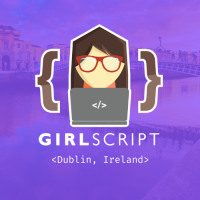

<h1 align = "center"> GirlScript Ireland Gaming</h1>

This repository comprises the sample code and miscellaneous stuff to be used for the Gaming Booster Program 2020 by GirlScript Ireland.

<h3 align = "center"> About Gaming Booster🤔🤔</h3>
Gaming Booster is an intiative taken up the GirlScript Ireland chapter to upskill students from all around the globe in the field of game development. It is a four week intiative that runs through the entire of August 2020. Participants from India,Ireland,Brazil,Spain,Mexico and Kazakhstan are guided to build two functionally games by the end of program. p5.js and Processing are preferred for development.

